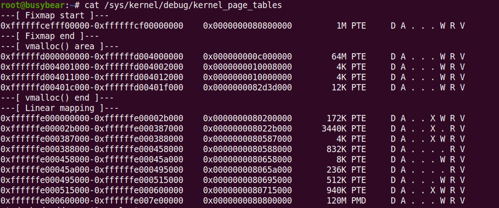

# RISC-V-Kernel-Page-Table

## Environment

Based on **linux 5.4.36**

* Ubuntu 18.04
* qemu 4.1.0
* risc-v cross compile tools
* busybear
* riscv proxy kernel

## How to use

In linux kernel directory:

```bash
$ patch -p1 < /path/to/RISC-V-Kernel-Page-Table.patch
```

If you want to remove this patch, use `-R` option.

## Result

After adding the kernel page table dumper:



